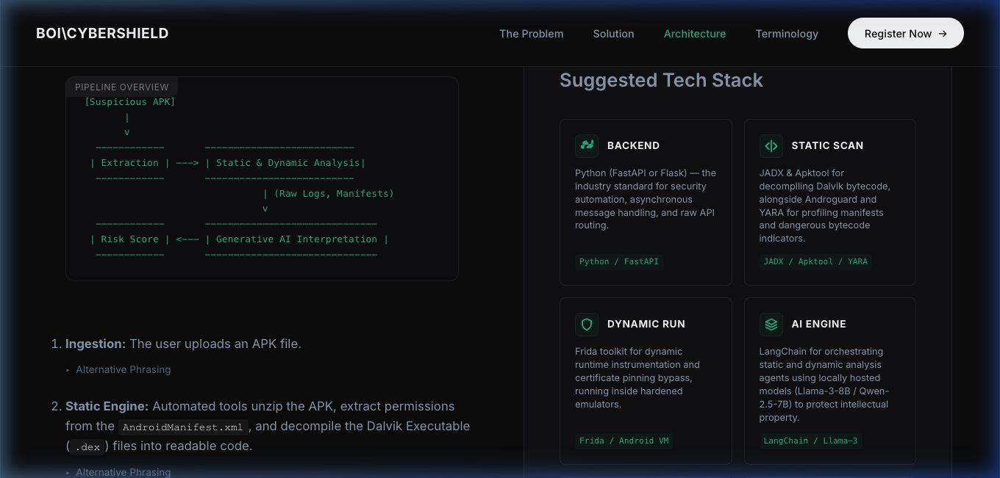
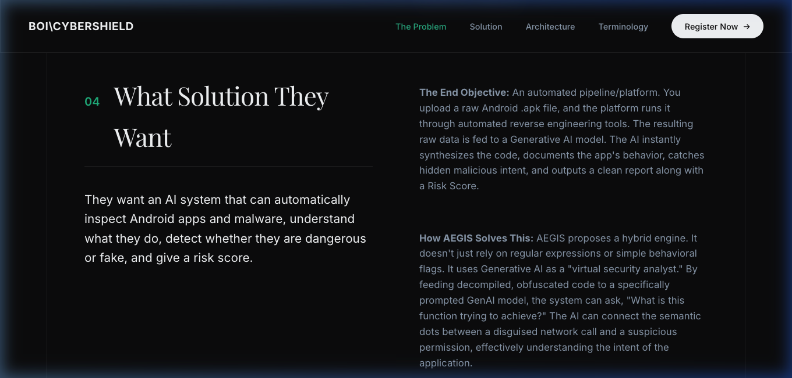
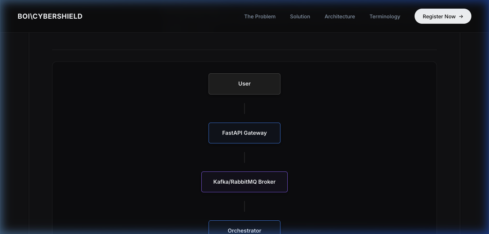
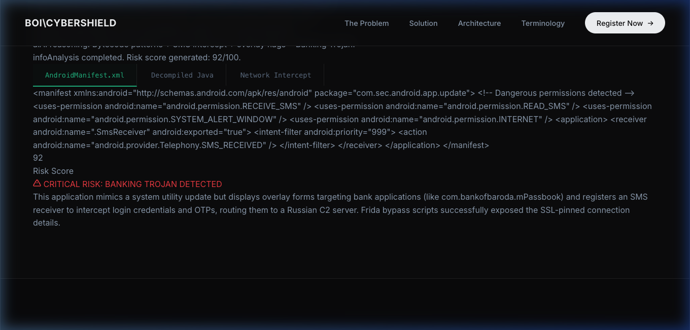
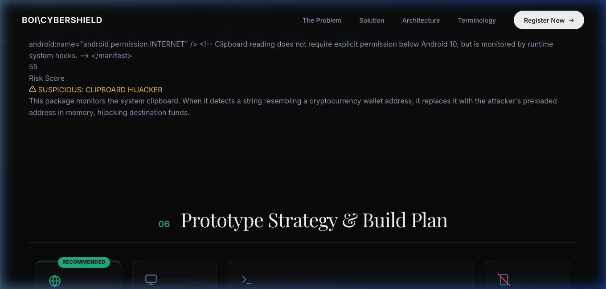

# Project AEGIS (Automated Engine for Generative Intelligence & Security)

**Project AEGIS** is a next-generation cybersecurity platform designed for the **Bank of India (BOI) CyberShield Hackathon 2026**. By bridging standard, highly rigorous reverse-engineering tools (such as Frida, JADX, and Apktool) with the semantic reasoning capabilities of local Large Language Models (LLMs), AEGIS automates Android malware decompilation, dynamic execution hooks, and threat intelligence synthesis.

---

## 🚀 Key Features

- **Asynchronous Event-Driven Architecture:** Asynchronous microservices pipeline scaled with FastAPI, RabbitMQ/Kafka, and ephemeral analysis containers.
- **AI-Driven Code De-obfuscation:** Automates Smali/Java reverse engineering by sending obfuscated bytecode fragments to local LLMs (e.g., Llama-3-8B) to semantic-map variables and understand underlying code logic.
- **Dynamic Hooking & SSL Pinning Bypass:** Automatically injects Frida instrumentations at app startup to hook `OkHttpClient` and `TrustManager` APIs, bypassing certificate pinning to capture raw C2 server communications.
- **AI Smart Monkey UI Fuzzing:** Utilizes computer vision and generative layouts to fill out UI fields intelligently using a pre-seeded test data library (mock accounts, OTPs, credentials).
- **MITRE ATT&CK Risk Scoring:** Aggregates threat logs and maps patterns into a math-normalized 0–100 risk score matrix.
- **Docker-Isolated Ingestion Boundary:** Air-gapped privacy boundary executing raw APK analyses locally, purging the binaries immediately after scan runs, and storing only lookup SHA-256 hashes.

---

## 🎨 Premium Editorial Design & Visuals

The web portal is built using a dark, minimalist newspaper design with clean structural grid borders, Inter/Playfair Display typography pairings, and structured visual maps:

### 1. Visual Tech Stack Grid (Section 05)
A visual deconstruction of the backend layers featuring descriptive metadata and clean inline SVG logos (including the vector Python logo).

### 2. Threat Metric Dashboard (Section 03)
Displays core threat statistics at a glance:

### 3. Privacy Isolation Flowchart (Section 08)
Visually details the three-step data retention boundaries:

---

## 💻 Interactive Sandbox Simulator

AEGIS incorporates a fully functional, browser-interactive sandbox simulator inside Section 05. It allows judges and bank analysts to pick a simulated target package and trigger the analysis pipeline live:

### Scanning FakeBankUpdate.apk (High Risk - 92/100)
Exposes the SMS Interceptor and Overlay injection patterns:

### Scanning CryptoWalletScanner.apk (Medium Risk - 55/100)
Exposes the Clipboard Hijacker wallet swapper patterns:

---

## 🎬 Live Playback Demo

Watch the real-time simulation showing console compilation logs, Frida cert-pinning bypasses, active thread score animations, and typed AI verdict reports:

